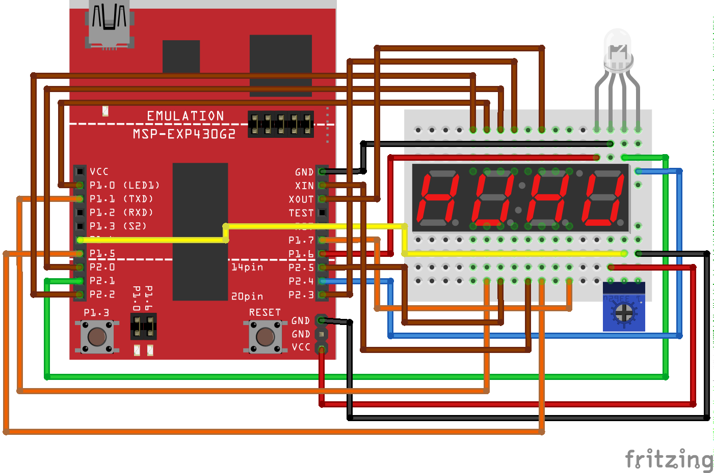

# Assignment Five: Color Selector

### Schematic

>There is a lot of wiring here, so _**do things in stages and test as you add things to your board!**_ **This is critial** for the project.

### Objective

For this assignment, you are to create a color selector using the RGB LED, button, potentiometer and 7-segment display. The behavior should be as follows:

1. On start up, green and blue should be off and the red color should be "selected".
    - the intensity of the red element is set using the potentiometer and
    - the value of that intensity should be shown on the 7-segment display (`_r00` - `_rFF`).
    - _Note that this means you have to change a value from the range `0` - `1023` to the range `0` - `255`._
1. Pressing the onboard switch selects the next color (green).
1. The intensity of the red element is _left at what it was set to when the switch was pressed_.
1. Now the next color can be set and the value of the intensity shown on the display (`_g00` - `_gFF`).
    - for green, you can use a lowercase `g` (a `9` with the bottom segment turned on)
1. Repeat for the _next_ color (blue).
1. Again, the brightness can be set and the value of the intensity shown on the display (`_b00` - `_bFF`).
1. Pressing the switch a third time should cycle back to setting the red color.
1. Periodically, **using a timer**, the microcontroller should output to the host (using `cio_printf()`) the name of the current color as determined from a large lookup array, which will be given to you.

#### This means, in software we are utilizing:

1. All 3 PWM channels (T0.1, T1.1, T1.2)
1. A timer interrupt for the display
    - _Note that this means the timer is doing both PWM and an interrupt!_
1. A timer interrupt for printing the color to the screen
    - _Note that this means the timer is doing both PWM and an interrupt!_
1. A button interrupt
1. The ADC10 module for analog input
    - a code file `dtc.c` is provided that implements an `initialize_dtc()` function, use this to work with the potentiometer!
1. A single UART pin (P1.2, UART TXD) that allows us to print to the host (UART RXD will not be used and must be reset after the call to `serial_init()`!)

That's it! Good luck and have fun!

